# About this gallary
 
On this page you will find some of the designs we have created for greeting cards.

We (mainly my wife) like tessellation designs, and we use tessellation designs based on Japanese zodiac signs for our annual New Year's cards.

These are mainly created using [Tess](http://www.peda.com/tess/).
 
We use Tess to design, and PhotoShop and gimp to edit and create our New Year's cards.

# About Tess

[Tess](http://www.peda.com/tess/) is bit old but one of most useful tool to create symmetric design.

> With Tess, you can quickly create attractive symmetric planar illustrations. While you draw, Tess will automatically maintain the symmetry group you have chosen; 24 rosette, all 7 frieze, and all 17 wallpaper groups are included. Some prize-winning entries from our annual Tessellation contest are shown on the right. Our Users Gallery shows some other interesting projects that Tess has been involved with.

Of course, you can create symmetrical designs with various tools such as illustrator, photoshop, and gimp, but Tess is just the right tool, neither too easy nor too complicated.

A little unfortunately, Tess is only available as a binary for Windows or classic mac OS. I am an old Mac user, so I used to use Tess on my PowerBook with PPC, but it is getting old and I feel that it could break at any time, so I put SheepShaver on my MacBook with Mac OS 9.0.2. I'm using it on my MacBook under Mac OS 9.0.2.

# Collections

## 2003

  

## 2004

  

## 2005

  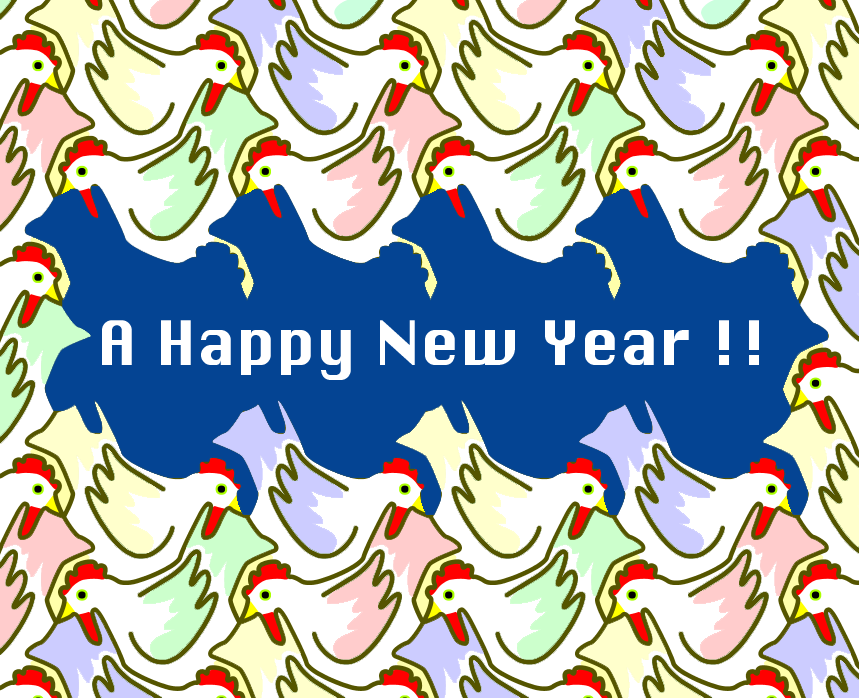

## 2007

  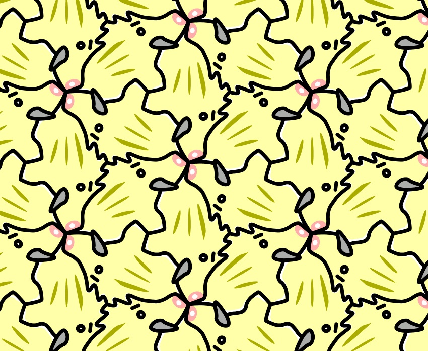

## 2008

  

## 2009

  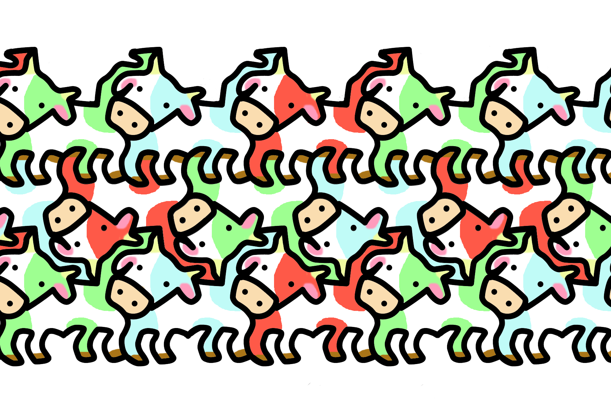

## 2010

  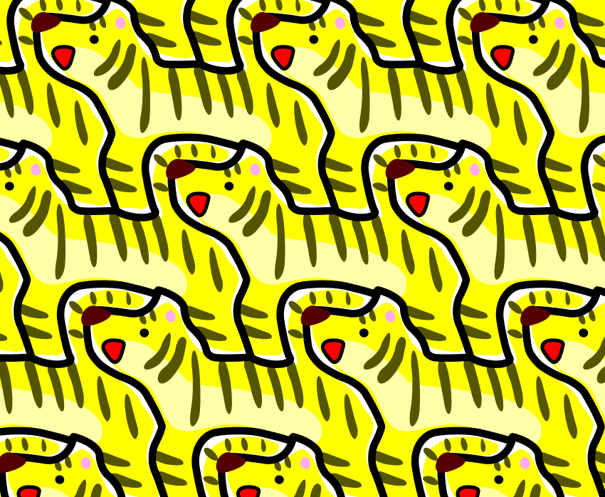

## 2013

  

## 2014

  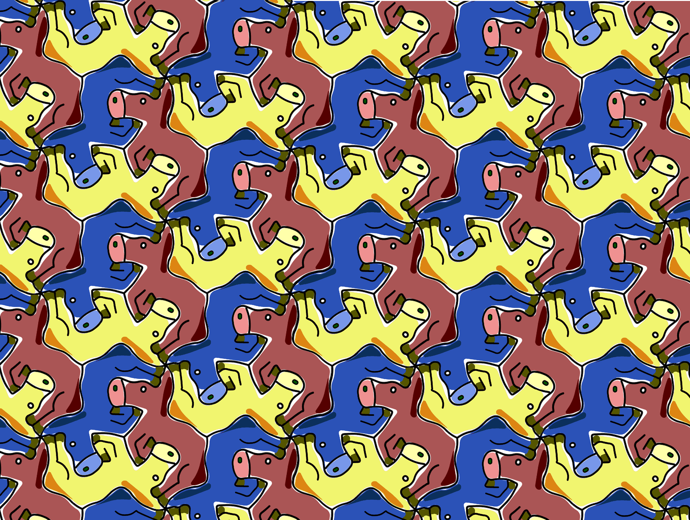

## 2015

  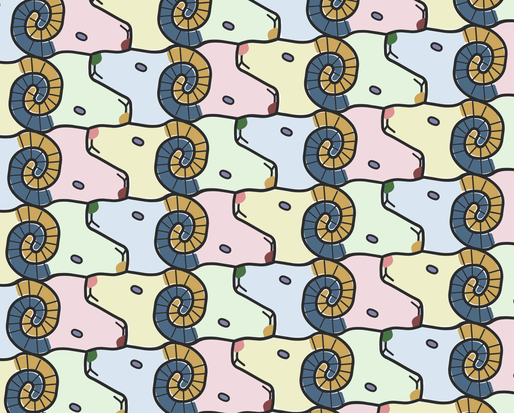

## 2016

  

## 2017

  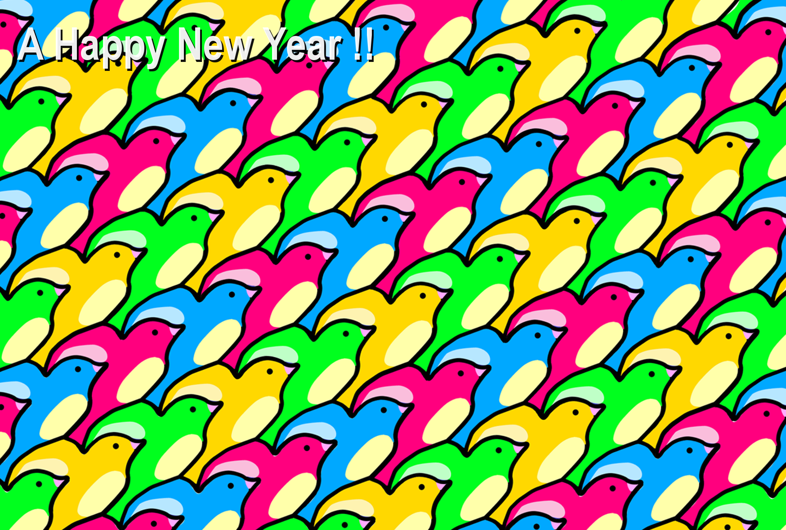

## 2018

  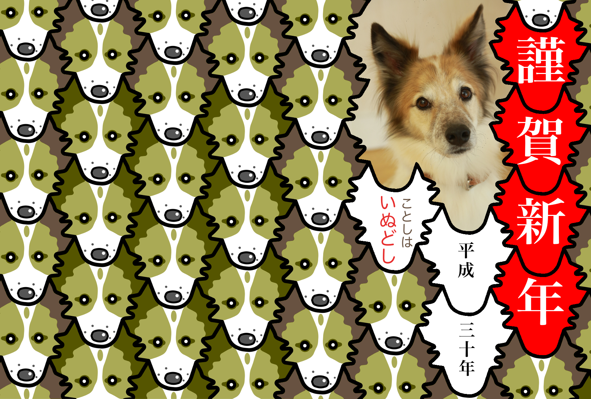

## 2019

  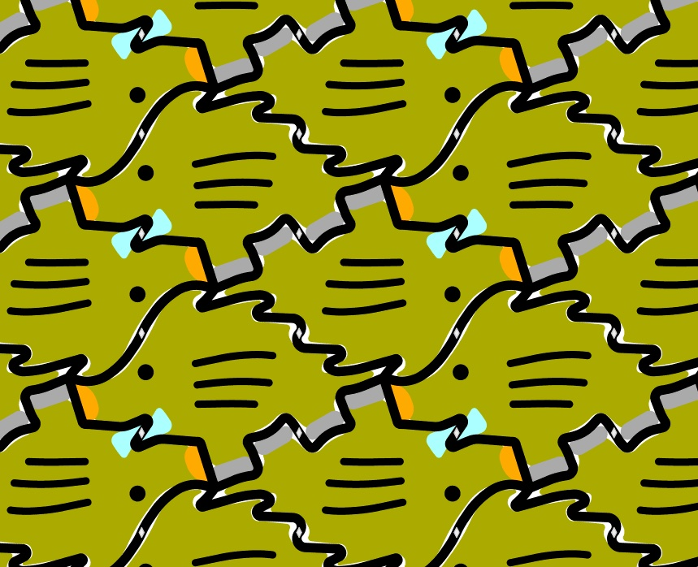

## 2020

  

## 2022

  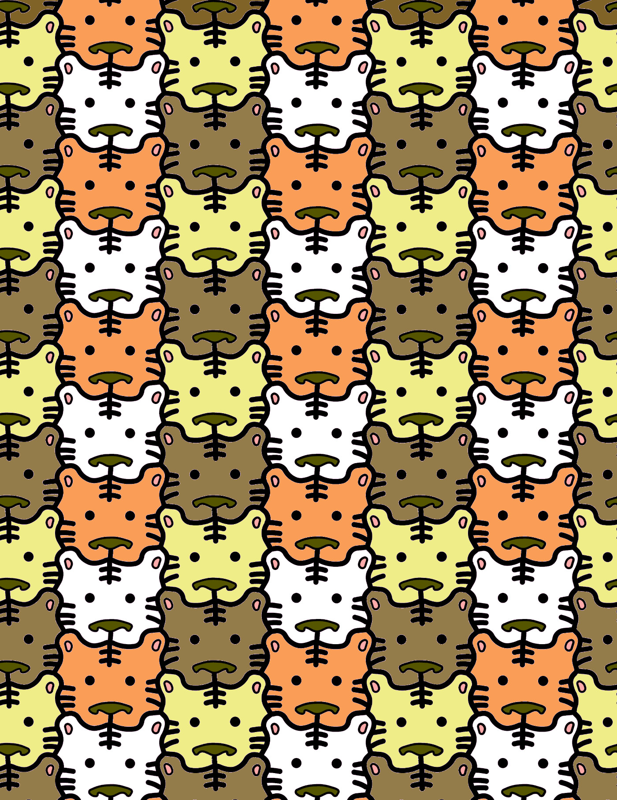

## 2023

  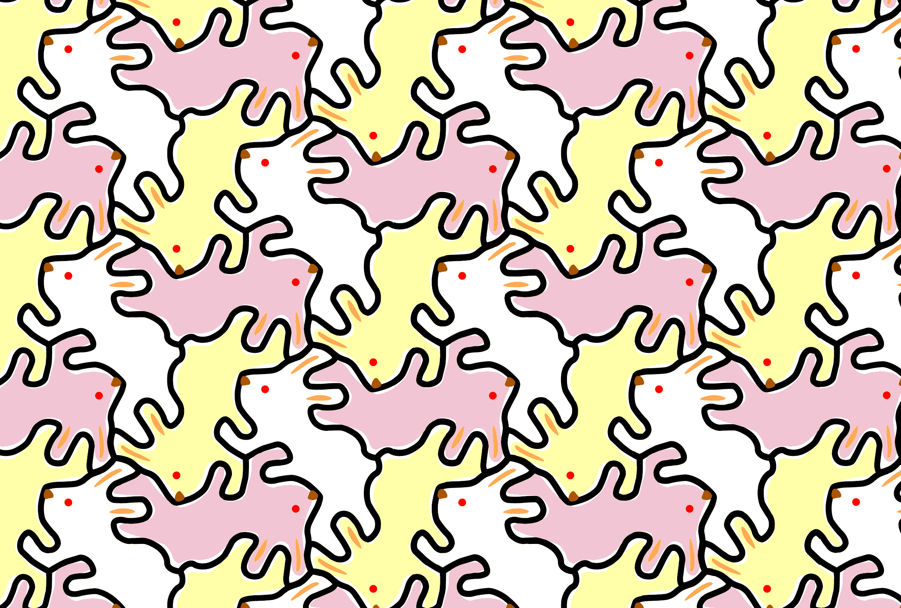

## 2024

  

